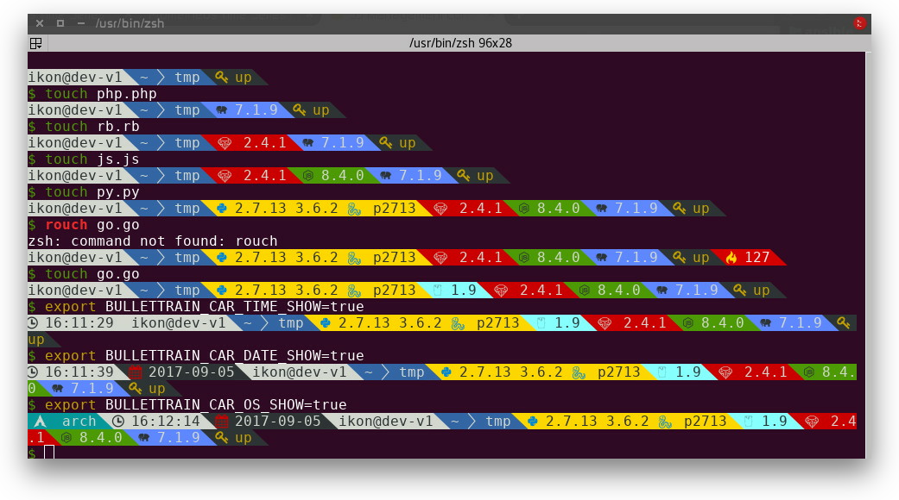
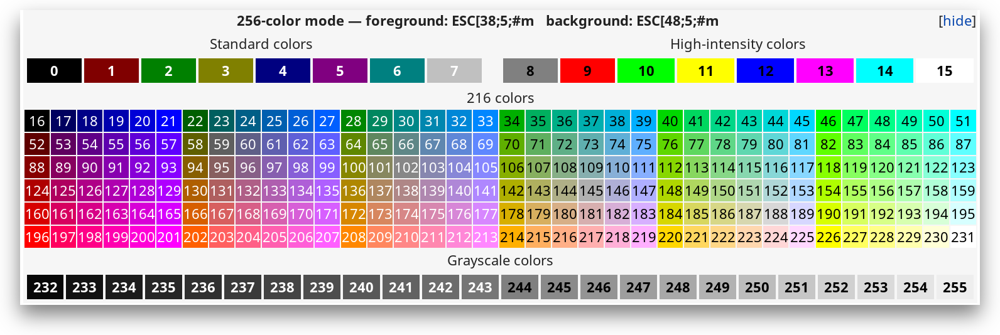

= Bullet Train shell prompt
:toc:

== Synopsis

Bullet Train is a http://www.zsh.org/[zsh] and https://www.gnu.org/software/bash/[bash] shell prompt theme inspired by the https://github.com/Lokaltog/vim-powerline[Powerline Vim plugin].

* Single binary with wide architecture support: Mac, Linux, Raspberry Pi (ARM)
* Go and 3rd party language plugin support
* Is as slow as it's slowest car, won't slow down linearily the more car you use.
* Latest Go version support for developers
* Triggering system to show only relevant information
* Almost everything can be overwritten through environment variables
* UTF-8 support out of the box (thanks to Go)
* 256 colour support, with special effects where the terminal software has support for them

== Core cars

* Time
* Date
* Current directory
* Exit code of last command
* User and hostname
* Background jobs
* OS icon and name
* Git status
* Current Python version and/or virtualenv
* Current Ruby version and/or gemset
* Current Node.js version
* Current Golang version
* Current PHP version

External modules could show: - perl - elixir - erlang - screen support - tmux support(?) - mercurial - _more are coming as we are going through the existing ones for the https://github.com/caiogondim/bullet-train.zsh[ZSH version]_

If you want to add some new feature, or fix some bug, open a ticket!

== Requirements

In order to use the theme, you will first need:

* A very cool font:
* https://nerdfonts.com/[Nerd fonts] (https://aur.archlinux.org/packages/nerd-fonts-complete/[Arch Linux AUR]) <- our default
* Alternatively a Powerline compatible font like https://github.com/Lokaltog/powerline-fonts[Vim Powerline patched fonts], http://input.fontbureau.com/[Input Mono] or http://larsenwork.com/monoid/[Monoid].
* On Ubuntu like systems you'll need the `ttf-ancient-fonts` package to correctly display some unicode symbols that are not covered by the Powerline fonts above. (https://aur.archlinux.org/packages/ttf-ancient-fonts/[Arch Linux AUR])
* Make sure terminal is using 256-colors mode with `export   TERM="xterm-256color"`
* For http://iterm2.com/[iTerm 2] users, make sure you go into your settings and set both the regular font and the non-ascii font to powerline compatible https://github.com/powerline/fonts[fonts] or the prompt separators and special characters will not display correctly.

== Compatible terminal emulators

* Linux
* https://gnunn1.github.io/tilix-web/[Tilix]
* https://gnometerminator.blogspot.ie/p/introduction.html[Terminator]
* https://konsole.kde.org/[Konsole]
* Windows WSL2 on https://github.com/microsoft/terminal[Windows Terminal]
* Mac
* http://iterm2.com/[iTerm2]

== Installing

{counter:installing}. We have prepared release executables on our release page

https://github.com/bullettrain-sh/bullettrain-go-core/releases.

Download the one that matches your architecture and OS.

Of course, you are more than welcomed to build your own, customised version if you feel comfortable with Go. link:docs/creating-new-cars.md[Here are some help to do that].

{counter:installing}. In your rc files you only need to set the single prompt variable.

:icons: font
IMPORTANT: Single quotes are important not to store the evaluated result in the variable, but to reevaluate on every call.

*ZSH - .zshrc*

`PROMPT='$(bullettrain $?)'`

*BASH - .bashrc*

[source,bash]
----
function _update_ps1() {
    PS1="$(/home/ikon/.local/bin/bullettrain $?)"
}
PROMPT_COMMAND="_update_ps1"
----

== Options

Most of the behaviours can be configured through environment variables, making you free from the recompiling work.

These are the *core* feature configuration variables and module configuration information can be found on their respective READMEs.

All envirnment variables must be exported for Go to be able to pick up.

E.g.: `export BULLETTRAIN_CAR_ORDER="time user host python ruby"`

=== Defining colours and text effects

Form of the colourization string: `foregroundColor+attributes:backgroundColor+attributes`

==== Colors

* black
* red
* green
* yellow
* blue
* magenta
* cyan
* white
* https://en.wikipedia.org/wiki/ANSI_escape_code#Colors[0...255 (256 colors)]

**NOTE**: support for some attributes varies across terminal emulator softwares.

==== Foreground Attributes

* B = Blink
* b = bold
* I = italic
* h = high intensity (bright)
* i = inverse
* s = strikethrough
* u = underline

==== Background Attributes

* h = high intensity (bright)

== Defining car templates

Car templates gives the user the most flexibility to rearrange/decorate the car's content further. With the template's help the user can also control which element of the car she wants to hide (although the processing of it is still done, so she gains no speed). The template language is using Go's standard library `text/template` package.

Here is an example which will introduce the concepts and usage:

The Time car could expose its icon and printed text (time).

There are a few rules to follow:

* exposed names start with a dot, because they will internally be bundled within a Go struct
* exposed names start with a capital letter, because the struct needs to expose them and everything is exposed (aka public) in Go if it is capitalised
* cars should define colouring functions that it should expose, with suggested naming:
* `cs`: function to colour the symbol
* `ci`: function to colour the information the car exposes
* `c`: function to colour the car's base colouring
* exposed names are enclosed in `{{` and `}}` as they are the Go template system's chosen delimiters
* template environment variables have the suffix of `_TEMPLATE`

Colour function names are suggestion and can vary in number and naming in plugins.

`{{.Icon}}` : the icon of the car `{{.Time}}` : the information this car exposes

Then one could surround the car's output text with spaces to her liking and define it in the env var:

`export BULLETTRAIN_CAR_TIME_TEMPLATE="{{.Icon | printf " %s " | cs }}{{.Time | c}}"`

`printf` is mapped to `fmt.Printf` and is perfect for adding spaces and other chars around the symbol, while in the second step of the pipeline is the colouring. This makes it easy not to leave the spaces without colours.

== Basic behaviours

|===
|Environment variable |Description |Default value

|BULLETTRAIN_CARS
|Control which cars to appear in what order, using their __callwords__.
|`os time date user host dir python go ruby nodejs php git status`

|BULLETTRAIN_CARS_SEPARATE_LINE
|Whether the cars should be on their own line above the prompt.
|true

|BULLETTRAIN_NO_PAINT
|Whether you wish not to use paint at all, aka black and white mode.
|false

|BULLETTRAIN_DEBUG
|Turning debug print mode on to help seeing actual character codes.
|false

|BULLETTRAIN_SEPARATOR_ICON
|Defines the car separator icon.
|\uE0B0 

|BULLETTRAIN_SEPARATOR_PAINT
|Defines the car separator icon's paint.
|calculated on the fly

|BULLETTRAIN_SEPARATOR_TEMPLATE
|Defines the car separator's template.
|`{{.Icon \| printf "%s " \| c}}`

|BULLETTRAIN_PROMPT_CHAR
|Redefines the end char of the prompt when you are a normal user.
|`$`

|BULLETTRAIN_PROMPT_CHAR_TEMPLATE
|Normal user's end char template.
|`{{.Icon \| printf "%s " \| c}}`

|BULLETTRAIN_PROMPT_CHAR_PAINT
|Redefines the end char's colour of the prompt when you are a normal user.
|green

|BULLETTRAIN_PROMPT_CHAR_ROOT
|Redefines the end char of the prompt when you are a root user.
|`#`

|BULLETTRAIN_PROMPT_CHAR_ROOT_TEMPLATE
|Root user's end char template.
|`{{.Icon \| printf "%s " \| c}}`

|BULLETTRAIN_PROMPT_CHAR_ROOT_PAINT
|Redefines the end char's colour of the prompt when you are a root user.
|red
|===

== Core cars

=== Time Car

Showing current time.

**Callword**: `time`

**Template variables**:

* `.Icon`: the car's icon
* `.Time`: the time text

**Template colours**:

* `c`: the car's colour
* `cs`: the car symbol's colour

*Options*

|===
|Environment variable |Description |Default value

|BULLETTRAIN_CAR_TIME_SHOW
|Whether the car needs to be shown.
|false

|BULLETTRAIN_CAR_TIME_TEMPLATE
|The car's template.
|`{{.Icon \| prinf " %s " \| cs}}{{.Time \| c}}`

|BULLETTRAIN_CAR_TIME_SYMBOL_ICON
|Icon displayed on the car.
|`\uF43A` 

|BULLETTRAIN_CAR_TIME_SYMBOL_PAINT
|Colour override for the car's symbol.
|white:black

|BULLETTRAIN_CAR_TIME_PAINT
|Colour override for the car's paint.
|white:black

|BULLETTRAIN_CAR_TIME_SEPARATOR_PAINT
|Colour override for the car's right-hand side separator paint.
|Using default painting algorythm.

|BULLETTRAIN_CAR_TIME_SEPARATOR_SYMBOL
|Override the car's right-hand side separator symbol.
|Using global symbol.

|BULLETTRAIN_CAR_TIME_12HR
|Use 12 hour format.
|false

|BULLETTRAIN_CAR_TIME_SEPARATOR_TEMPLATE
|Defines the car separator's template.
|Using global template.

|===

=== Date Car

Showing current date. Format: `YYYY-MM-DD`

**Callword**: `date`

**Template variables**:

* `.Icon`: the car's icon
* `.Date`: the date text

**Template colours**:

* `c`: the car's colour
* `cs`: the car symbol's colour

*Options*

|===
|Environment variable |Description|Default value

|BULLETTRAIN_CAR_DATE_SHOW
|Whether the car needs to be shown. |
false

|BULLETTRAIN_CAR_DATE_TEMPLATE
|The car's template.
|`{{.Icon \| printf "%s" \| cs}}{{.Date \| c}}`

|BULLETTRAIN_CAR_DATE_PAINT
|Colour override for the car's paint.
|red:black

|BULLETTRAIN_CAR_DATE_SYMBOL_ICON
|Icon displayed on the car.
|`\uF073` 

|BULLETTRAIN_CAR_DATE_SYMBOL_PAINT
|Colour override for the car's symbol.
|white:black

|BULLETTRAIN_CAR_DATE_SEPARATOR_PAINT
|Colour override for the car's right-hand side separator paint.
|Using default painting algorythm.

|BULLETTRAIN_CAR_DATE_SEPARATOR_SYMBOL
|Override the car's right-hand side separator symbol.
|Using global symbol.

|BULLETTRAIN_CAR_DATE_SEPARATOR_TEMPLATE
|Defines the car separator's template.
|Using global template.

|===

=== User Car

Showing current username.

**Callword**: `user`

**Template variables**:

* `.User`: the user name text

**Template colours**:

* `c`: the car's colour

*Options*

|===
|Environment variable |Description |Default value

|BULLETTRAIN_CAR_USER_SHOW
|Whether the car needs to be shown.
|true

|BULLETTRAIN_CAR_USER_PAINT
|Colour override for the car's paint.
|black:white

|BULLETTRAIN_CAR_USER_TEMPLATE
|The car's template.
|`{{.User \| c}}`

|BULLETTRAIN_CAR_USER_SEPARATOR_PAINT
|Colour override for the car's right-hand side separator paint.
|Using default painting algorythm.

|BULLETTRAIN_CAR_USER_SEPARATOR_SYMBOL
|Override the car's right-hand side separator symbol.
|Using global symbol.

|BULLETTRAIN_CAR_USER_SEPARATOR_TEMPLATE
|Defines the car separator's template.
|Using global template.

|===

=== Host Car

Showing current hostname.

**Callword**: `host`

**Template variables**:

* `.Icon`: the car's icon
* `.Date`: the date text

**Template colours**:

* `c`: the car's colour
* `cs`: the car symbol's colour

*Options*

|===
|Environment variable |Description |Default value

|BULLETTRAIN_CAR_HOST_SHOW
|Whether the car needs to be shown.
|true

|BULLETTRAIN_CAR_HOST_PAINT
|Colour override for the car's paint.
|black:white

|BULLETTRAIN_CAR_HOST_TEMPLATE
|The car's template.
|`{{.Host \| c}}`

|BULLETTRAIN_CAR_HOST_SEPARATOR_PAINT
|Colour override for the car's right-hand side separator paint.
|Using default painting algorythm.

|BULLETTRAIN_CAR_HOST_SEPARATOR_SYMBOL
|Override the car's right-hand side separator symbol.
|Using global symbol.

|BULLETTRAIN_CAR_HOST_SEPARATOR_TEMPLATE
|Defines the car separator's template.
|Using global template.

|===

=== Directory Car

Showing current directory.

**Callword**: `dir`

*Options*

|===
|Environment variable |Description |Default value

|BULLETTRAIN_CAR_DIRECTORY_SHOW
|Whether the car needs to be shown.
|true

|BULLETTRAIN_CAR_DIRECTORY_PAINT
|Colour override for the car's paint.
|white:blue

|BULLETTRAIN_CAR_DIRECTORY_SEPARATOR_PAINT
|Colour override for the car's right-hand side separator paint.
|Using default painting algorythm.

|BULLETTRAIN_CAR_DIRECTORY_SEPARATOR_SYMBOL
|Override the car's right-hand side separator symbol.
|Using global symbol.

|BULLETTRAIN_CAR_DIRECTORY_PATH_SEPARATOR
|Set a custom path separator character.
|`\uF105` 

|BULLETTRAIN_CAR_DIRECTORY_FRONT_MAX_LENGTH
|Set the number of parent directories's front displayed. Setting it to negative means to show all of directories.
|2

|BULLETTRAIN_CAR_DIRECTORY_TAIL_MAX_LENGTH
|Set the number of parent directories's tail displayed. Setting it to negative means to show all of directories.
|2

|BULLETTRAIN_CAR_DIRECTORY_DEPTH_INDICATOR
|Indicator of too deep directory structure in `merge` mode.
|`\uF142` 

|BULLETTRAIN_CAR_DIRECTORY_ELLIPSIS
|Ellipsis symbol of directory name in `acronym` mode.
|`*`

|BULLETTRAIN_CAR_DIRECTORY_ABBREVIATE_MODE
|Abbreviate mode of too deep directory structure. Set to `merge` for using "/usr/lib/.../pkg" style, set to `acronym` for using "/user/lib/g__/s__/pkg" style.
|`acronym`

|===

=== OS Car

Showing current operating system logo. Mainly purposed as a design element.

**Callword**: `os`

**Template variables**:

* `.Icon`: the car's icon
* `.Name`: the OS name text

**Template colours**:

* `c`: the car's colour
* `cs`: the car symbol's colour

*Options*

|===
|Environment variable |Description |Default value

|BULLETTRAIN_CAR_OS_SHOW
|Whether the car needs to be shown.
|false

|BULLETTRAIN_CAR_OS_PAINT
|Colour override for the car's paint.
|white:cyan

|BULLETTRAIN_CAR_OS_TEMPLATE
|The car's template.
|`{{.Icon \| printf "%s " \| cs}}{{.Name \| c}}`

|BULLETTRAIN_CAR_OS_SYMBOL_PAINT
|Colour override for the car's symbol.
|white:cyan

|BULLETTRAIN_CAR_OS_SYMBOL_ICON
|Icon displayed on the car.
|`\uF83C` 

|BULLETTRAIN_CAR_OS_SEPARATOR_PAINT
|Colour override for the car's right-hand side separator paint.
|Using default painting algorythm.

|BULLETTRAIN_CAR_OS_SEPARATOR_SYMBOL
|Override the car's right-hand side separator symbol.
|Using global symbol.

|BULLETTRAIN_CAR_OS_SEPARATOR_TEMPLATE
|Defines the car separator's template.
|Using global template.

|===

=== Last command exit code Car

Showing last command's exit code.

Since the bullettrain executable is running as a separate process as the shell which is executing it, it needs to get the last command's exit code by an argument.

Shells have a special global for it: `$?`

ZSH example:

`PROMPT='$(bullettrain $?)'`

**Callword**: `status`

**Template variables**:

* `.Icon`: the car's icon
* `.Code`: the error code text

**Template colours**:

* `c`: the car's colour
* `cs`: the car symbol's colour

*Options*

|===
|Environment variable |Description |Default value

|BULLETTRAIN_CAR_STATUS_SHOW
|Whether the car needs to be shown.
|false

|BULLETTRAIN_CAR_STATUS_TEMPLATE
|The car's template.
|`{{.Icon \| printf "%s " \| cs}}{{.Code \| c}}`

|BULLETTRAIN_CAR_STATUS_SYMBOL_ICON
|Icon displayed on the car.
|`\uF490` 

|BULLETTRAIN_CAR_STATUS_SYMBOL_PAINT
|Colour override for the car's symbol.
|yellow:red

|BULLETTRAIN_CAR_STATUS_PAINT
|Colour override for the car's paint.
|white:red

|BULLETTRAIN_CAR_STATUS_SEPARATOR_PAINT
|Colour override for the car's right-hand side separator paint.
|Using default painting algorythm.

|BULLETTRAIN_CAR_STATUS_SEPARATOR_SYMBOL
|Override the car's right-hand side separator symbol.
|Using global symbol.

|===

=== Background jobs Car

https://github.com/bullettrain-sh/bullettrain-go-core/issues/24

=== Git Car

* Displaying only when needed
* Current branch name
* State of the branch

**Callword**: `git`

**Template variables**:

* `.Icon`: the car's icon
* `.Name`: the name of the branch
* `.StatusIcon`: the status icons

**Template colours**:

* `c`: the car's colour
* `cs`: the car symbol's colour
* `css`: the status icon symbol's colour

*Options*

|===
|Environment variable |Description |Default value

|BULLETTRAIN_CAR_GIT_PAINT
|Colour override for the car't paint.
|red:white

|BULLETTRAIN_CAR_GIT_TEMPLATE
|The car's template.
|`{{.Icon \| printf "%s " \| cs}}{{.Name \| c}}{{.StatusIcon \| printf " %s"\| csi}}`

|BULLETTRAIN_CAR_GIT_SYMBOL_ICON
|Icon displayed on the car.
|`\uE702` 

|BULLETTRAIN_CAR_GIT_SYMBOL_PAINT
|Colour override for the car's symbol.
|red:white

|BULLETTRAIN_CAR_GIT_DIRTY_ICON
|Icon displayed when there are changes.
|`\uF00D` 

|BULLETTRAIN_CAR_GIT_DIRTY_PAINT
|Colour override for the dirty symbol.
|red:white

|BULLETTRAIN_CAR_GIT_CLEAN_ICON
|Icon displayed when there are no changes.
|`\uF632` 

|BULLETTRAIN_CAR_GIT_CLEAN_PAINT
|Colour override for the clean symbol.
|green:white

|BULLETTRAIN_CAR_GIT_SEPARATOR_PAINT
|Colour override for the car's right-hand side separator paint.
|Using default painting algorythm.

|BULLETTRAIN_CAR_GIT_SEPARATOR_SYMBOL
|Override the car's right-hand side separator symbol.
|Using global symbol.

|BULLETTRAIN_CAR_GIT_SEPARATOR_TEMPLATE
|Defines the car separator's template.
|Using global template.

|===

=== Go/Golang Car

* Displaying only when needed
* Go version display

**Callword**: `go`

**Template variables**:

* `.Icon`: the car's icon
* `.Info`: the Go version text

**Template colours**:

* `c`: the car's colour
* `cs`: the car symbol's colour

*Options*

|===
|Environment variable |Description |Default value

|BULLETTRAIN_CAR_GO_SHOW
|Whether the car needs to be shown all the time.
|false

|BULLETTRAIN_CAR_GO_TEMPLATE
|The car's template.
|`{{.Icon \| printf "%s " \| cs}}{{.Info \| c}}`

|BULLETTRAIN_CAR_GO_PAINT
|Colour override for the car's paint.
|black:123

|BULLETTRAIN_CAR_GO_SYMBOL_ICON
|Icon displayed on the car.
|`\uE627` 

|BULLETTRAIN_CAR_GO_SYMBOL_PAINT
|Colour override for the car's symbol.
|black:123

|BULLETTRAIN_CAR_GO_SEPARATOR_PAINT
|Colour override for the car's right-hand side separator paint.
|Using default painting algorythm.

|BULLETTRAIN_CAR_GO_SEPARATOR_SYMBOL
|Override the car's right-hand side separator symbol.
|Using global symbol.

|BULLETTRAIN_CAR_GO_SEPARATOR_TEMPLATE
|Defines the car separator's template.
|Using global template.

|===

=== Node.js Car

* Displaying only when needed (*.js, .nvmrc)
* Node version display

**Callword**: `nodejs`

**Template variables**:

* `.Icon`: the car's icon
* `.Info`: the Nodejs version text

**Template colours**:

* `c`: the car's colour
* `cs`: the car symbol's colour

*Options*

|===
|Environment variable |Description |Default value

|BULLETTRAIN_CAR_NODEJS_SHOW
|Whether the car needs to be shown all the time.
|false

|BULLETTRAIN_CAR_NODEJS_TEMPLATE
|The car's template.
|`{{.Icon \| printf "%s " \| cs}}{{.Info \| c}}`

|BULLETTRAIN_CAR_NODEJS_PAINT
|Colour override for the car's paint.
|white:green

|BULLETTRAIN_CAR_NODEJS_SYMBOL_ICON
|Icon displayed on the car.
|`\uF898` 

|BULLETTRAIN_CAR_NODEJS_SYMBOL_PAINT
|Colour override for the car's symbol.
|black:green

|BULLETTRAIN_CAR_NODEJS_SEPARATOR_PAINT
|Colour override for the car's right-hand side separator paint.
|Using default painting algorythm.

|BULLETTRAIN_CAR_NODEJS_SEPARATOR_SYMBOL
|Override the car's right-hand side separator symbol.
|Using global symbol.

|BULLETTRAIN_CAR_NODEJS_SEPARATOR_TEMPLATE
|Defines the car separator's template.
|Using global template.

|===

=== Openvpn Car

* Displaying all known VPNs and their up/down status
* Currently working only with systemd units

**Callword**: `openvpn`

**Template variables**:

* `.Icon`: the car's icon
* `.Statuses`: the VPN status icon

**Template colours**:

* `c`: the car's colour
* `cs`: the car symbol's colour

*Options*

|===
|Environment variable |Description |Default value

|BULLETTRAIN_CAR_OPENVPN_SHOW
|Whether the car needs to be shown all the time.
|false

|BULLETTRAIN_CAR_OPENVPN_TEMPLATE
|The car's template.
|`{{.Icon | printf "%s " | cs}}{{range $name, $status := .Statuses}}{{printStatus $name $status}}{{end}}`

|BULLETTRAIN_CAR_OPENVPN_PAINT
|Colour override for the car't paint.
|208:black

|BULLETTRAIN_CAR_OPENVPN_SYMBOL_ICON
|Icon displayed on the car.
|``

|BULLETTRAIN_CAR_OPENVPN_SYMBOL_PAINT
|Colour override for the car's symbol.
|208:black

|BULLETTRAIN_CAR_OPENVPN_SYMBOL_ICON_LOCKED
|Icon displayed when the VPN connection is up.
|``

|BULLETTRAIN_CAR_OPENVPN_SYMBOL_PAINT_LOCKED
|Colour override for the VPN up symbol.
|green:black

|BULLETTRAIN_CAR_OPENVPN_SYMBOL_ICON_UNLOCKED
|Icon displayed when the VPN connection is down.
|``

|BULLETTRAIN_CAR_OPENVPN_SYMBOL_PAINT_UNLOCKED
|Colour override for the VPN down symbol.
|red:black

|BULLETTRAIN_CAR_OPENVPN_SEPARATOR_PAINT
|Colour override for the car's right-hand side separator paint.
|Using default painting algorythm.

|BULLETTRAIN_CAR_OPENVPN_SEPARATOR_SYMBOL
|Override the car's right-hand side separator symbol.
|Using global symbol.

|BULLETTRAIN_CAR_OPENVPN_SEPARATOR_TEMPLATE
|Defines the car separator's template.
|Using global template.

|===

=== Python Car

* Displaying only when needed
* Python version display
* Virtualenv display
* Support for https://github.com/pyenv/pyenv[Pyenv] and it's https://github.com/pyenv/pyenv-virtualenv[virtualenv] plugin

**Callword**: `python`

**Template variables**:

* `.VersionIcon`: the Python version icon
* `.Version`: the Python version text
* `.VenvIcon`: the Python virtualenv icon
* `.Venv`: the Python virtualenv text

**Template colours**:

* `c`: the Python version colour
* `cs`: the Python version symbol's colour
* `cvs`: the Python virtualenv symbol's colour

*Options*

|===
|Environment variable |Description |Default value

|BULLETTRAIN_CAR_PYTHON_SHOW
|Whether the car needs to be shown all the time.
|false

|BULLETTRAIN_CAR_PYTHON_TEMPLATE
|The car's template.
|`{{.VersionIcon \| printf "%s " \| cs}}{{.Version \| printf "%s " \| c}}{{.VenvIcon \| printf "%s " \| cvs}}{{.Venv \| c}}`

|BULLETTRAIN_CAR_PYTHON_PAINT
|Colour override for the car't paint.
|black:220

|BULLETTRAIN_CAR_PYTHON_SYMBOL_ICON
|Icon displayed on the car.
|`\uE235` 

|BULLETTRAIN_CAR_PYTHON_SYMBOL_PAINT
|Colour override for the car's symbol.
|32:220

|BULLETTRAIN_CAR_PYTHON_VIRTUALENV_SYMBOL_ICON
|Icon displayed on the car.
|`\xf0\x9f\x90\x8d` 🐍

|BULLETTRAIN_CAR_PYTHON_VIRTUALENV_SYMBOL_PAINT
|Colour override for the car's symbol.
|32:220

|BULLETTRAIN_CAR_PYTHON_SEPARATOR_PAINT
|Colour override for the car's right-hand side separator paint.
|Using default painting algorythm.

|BULLETTRAIN_CAR_PYTHON_SEPARATOR_SYMBOL
|Override the car's right-hand side separator symbol.
|Using global symbol.

|BULLETTRAIN_CAR_PYTHON_SEPARATOR_TEMPLATE
|Defines the car separator's template.
|Using global template.

|===

=== Ruby Car

* Displaying only when needed
* Ruby version display

**Callword**: `ruby`

**Template variables**:

* `.Icon`: the car's icon
* `.Info`: the Ruby version text

**Template colours**:

* `c`: the car's colour
* `cs`: the car symbol's colour

*Options*

|===
|Environment variable |Description |Default value

|BULLETTRAIN_CAR_RUBY_SHOW
|Whether the car needs to be shown all the time.
|false

|BULLETTRAIN_CAR_RUBY_TEMPLATE
|The car's template.
|`{{.Icon \| printf "%s " \| cs}}{{.Info \| c}}`

|BULLETTRAIN_CAR_RUBY_PAINT
|Colour override for the car't paint.
|white:red

|BULLETTRAIN_CAR_RUBY_SYMBOL_ICON
|Icon displayed on the car.
|`\uE23E` 

|BULLETTRAIN_CAR_RUBY_SYMBOL_PAINT
|Colour override for the car's symbol.
|white:red

|BULLETTRAIN_CAR_RUBY_SEPARATOR_PAINT
|Colour override for the car's right-hand side separator paint.
|Using default painting algorythm.

|BULLETTRAIN_CAR_RUBY_SEPARATOR_SYMBOL
|Override the car's right-hand side separator symbol.
|Using global symbol.

|BULLETTRAIN_CAR_RUBY_SEPARATOR_TEMPLATE
|Defines the car separator's template.
|Using global template.

|===

=== PHP Car

* Displaying only when needed
* PHP version display

**Callword**: `php`

**Template variables**:

* `.Icon`: the car's icon
* `.Info`: the PHP version text

**Template colours**:

* `c`: the car's colour
* `cs`: the car symbol's colour

*Options*

|===
|Environment variable |Description |Default value

|BULLETTRAIN_CAR_PHP_SHOW
|Whether the car needs to be shown all the time.
|false

|BULLETTRAIN_CAR_PHP_TEMPLATE
|The car's template.
|`{{.Icon \| printf "%s " \| cs}}{{.Info \| c}}`

|BULLETTRAIN_CAR_PHP_PAINT
|Colour override for the car't paint.
|white:69

|BULLETTRAIN_CAR_PHP_SYMBOL_ICON
|Icon displayed on the car.
|`\uE608` 

|BULLETTRAIN_CAR_PHP_SYMBOL_PAINT
|Colour override for the car's symbol.
|black:69

|BULLETTRAIN_CAR_PHP_SEPARATOR_PAINT
|Colour override for the car's right-hand side separator paint.
|Using default painting algorythm.

|BULLETTRAIN_CAR_PHP_SEPARATOR_SYMBOL
|Override the car's right-hand side separator symbol.
|Using global symbol.

|BULLETTRAIN_CAR_PHP_SEPARATOR_TEMPLATE
|Defines the car separator's template.
|Using global template.

|===

=== Kubernetes Car

Originally from: https://github.com/devkanro

* Displaying only when kubectl installed
* Kubernetes context display

**Callword**: `k8s`

**Template variables**:

* `.Icon`: the car's icon
* `.Context`: the Kubernetes context text

**Template colours**:

* `c`: the car's colour

*Options*

|===
|Environment variable |Description |Default value

|BULLETTRAIN_CAR_K8S_SHOW
|Whether the car needs to be shown all the time.
|true

|BULLETTRAIN_CAR_K8S_TEMPLATE
|The car's template.
|`{{.Icon \| printf " %s " \| c}}{{.Context \| c}}`

|BULLETTRAIN_CAR_K8S_PAINT
|Colour override for the car's paint.
|white+h:yellow

|BULLETTRAIN_CAR_K8S_SYMBOL_ICON
|Icon displayed on the car.
|`\uFD31` ﴱ

|BULLETTRAIN_CAR_K8S_SEPARATOR_PAINT
|Colour override for the car's right-hand side separator paint.
|Using default painting algorythm.

|BULLETTRAIN_CAR_K8S_SEPARATOR_SYMBOL
|Override the car's right-hand side separator symbol.
|Using global symbol.

|BULLETTRAIN_CAR_K8S_SEPARATOR_TEMPLATE
|Defines the car separator's template.
|Using global template.

|===

== Development

== Managing dependencies

We use `go dep` as it is now production ready.

https://github.com/golang/dep

== Plugins

We support link:docs/creating-new-cars.md[native Go cars] compiled right into the prompt builder, or ones link:docs/creating-plugin-car.md[written in other languages] . Plugins written in other languages will still benefit (to a degree) from Go's parallel execution.

== Benchmarking

We not only want the prompt to be super sexy but also super snappy. What'd be the point writting it in Go?! :)

So to bluntly benchmark it's speed, build the executable and then sample a 10x batch 5 times like this in ZSH:

....
$ go build bullettrain.go
$ repeat 5 (time (repeat 10 ./bullettrain > /dev/null))
( repeat 10; do; ./bullettrain > /dev/null; done; )  0.48s user 0.16s system 107% cpu 0.590 total
( repeat 10; do; ./bullettrain > /dev/null; done; )  0.48s user 0.14s system 107% cpu 0.581 total
( repeat 10; do; ./bullettrain > /dev/null; done; )  0.51s user 0.15s system 107% cpu 0.615 total
( repeat 10; do; ./bullettrain > /dev/null; done; )  0.49s user 0.17s system 107% cpu 0.613 total
( repeat 10; do; ./bullettrain > /dev/null; done; )  0.51s user 0.17s system 107% cpu 0.625 total
....

Be sure to benchmark your code to make sure you are not introducing a feature that will make the prompt sluggish all of a sudden.

== Support

https://t.me/joinchat/GUPcrhEYq_KJI48VIxxgsQ[Telegram Group]

== FAQ

*Q: Why don't we use BULLETTRAIN_CARS to disable the unwanted cars?*

*A:* As Go is statically linked and every car you need, needs to be compiled into the single executable, setting a single env var won't change the size of it, though will change the speed of execution somewhat. The main reason is that people like to see a variable doing a single job and doing it well. Therefore you are capable of not loading the cars by the `BULLETTRAIN_CARS` variable, but the `_SHOW` suffixed ones are really tasked doing just that.

== Issues

Have a look at https://github.com/bullettrain-sh/bullettrain-go-core/issues?q=is%3Aissue+is%3Aopen+label%3Abug[the issues labeled as bugs]

== Credits

This theme is highly inspired by the following themes:

* https://github.com/jeremyFreeAgent/oh-my-zsh-powerline-theme[Powerline]
* https://gist.github.com/agnoster/3712874[Agnoster]
