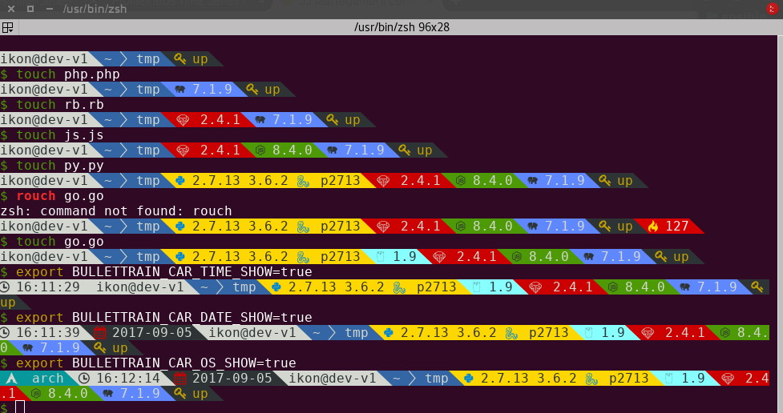
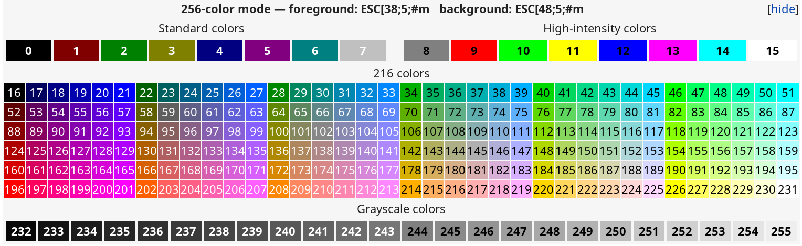

# Bullet Train shell prompt [BETA VERSION :bomb:]


Bullet Train is a [zsh](http://www.zsh.org/) &
[bash](https://www.gnu.org/software/bash/) shell prompt theme inspired
by the
[Powerline Vim plugin](https://github.com/Lokaltog/vim-powerline).


- [Bullet Train shell prompt [BETA VERSION :bomb:]](#bullet-train-shell-prompt-beta-version-bomb)
  - [Features](#features)
  - [Requirements](#requirements)
  - [Compatible terminal emulators](#compatible-terminal-emulators)
  - [Installing](#installing)
    - [Arch Linux - AUR](#arch-linux---aur)
  - [Options](#options)
    - [Defining colours and text effects](#defining-colours-and-text-effects)
    - [Basic behaviours](#basic-behaviours)
  - [Core cars](#core-cars)
    - [Time Car](#time-car)
    - [Date Car](#date-car)
    - [Context Car](#context-car)
    - [Directory Car](#directory-car)
    - [OS Car](#os-car)
    - [Last command exit code Car](#last-command-exit-code-car)
    - [Background jobs Car](#background-jobs-car)
  - [Development](#development)
    - [Managing dependencies](#managing-dependencies)
    - [Benchmarking](#benchmarking)
  - [Support](#support)
  - [FAQ](#faq)
    - [Q: Why don't we use `BULLETTRAIN_CARS` to disable the unwanted cars?](#q-why-dont-we-use-`bullettraincars`-to-disable-the-unwanted-cars)
    - [Q: What about plugins?](#q-what-about-plugins)
  - [Issues](#issues)
  - [Credits](#credits)


## Features



* Single binary with wide architecture support: Mac, Linux, Raspberry Pi
  (ARM)
* Go and 3rd party language plugin support
* Is as slow as it's slowest car, won't slow down linearily the more car
  you use.
* Latest Go version support for developers
* Triggering system to show only relevant information
* Almost everything can be overwritten through environment variables
* UTF-8 support out of the box (thanks to Go)
* 256 colour support, with special effects where the terminal software
  has support for them

Core cars:

- Time
- Date
- Current directory
- Exit code of last command
- User and hostname
- Background jobs
- OS icon and name

External modules can show:

- Git status (https://github.com/bullettrain-sh/bullettrain-go-git)
- Current Python version and/or virtualenv
  (https://github.com/bullettrain-sh/bullettrain-go-python)
- Current Ruby version and/or gemset
  (https://github.com/bullettrain-sh/bullettrain-go-ruby)
- Current Node.js version
  (https://github.com/bullettrain-sh/bullettrain-go-nodejs)
- Current Golang version
  (https://github.com/bullettrain-sh/bullettrain-go-golang)
- Current PHP version
  (https://github.com/bullettrain-sh/bullettrain-go-php)
- _more are coming as we are going through the existing ones for the
  [ZSH version](https://github.com/caiogondim/bullet-train.zsh)_

  - perl
  - elixir
  - erlang
  - screen support
  - tmux support?
  - mercurial
  - and more...

If you want add some new feature, or fix some bug, open a ticket!

## Requirements

In order to use the theme, you will first need:

* A very cool font:

  * [Nerd fonts](https://nerdfonts.com/)
    ([Arch Linux AUR](https://aur.archlinux.org/packages/nerd-fonts-complete/))
  * Powerline compatible fonts like
    [Vim Powerline patched fonts](https://github.com/Lokaltog/powerline-fonts),
    [Input Mono](http://input.fontbureau.com/) or
    [Monoid](http://larsenwork.com/monoid/).
  * On Ubuntu like systems you'll need the `ttf-ancient-fonts` package
    to correctly display some unicode symbols that are not covered by
    the Powerline fonts above.

* Make sure terminal is using 256-colors mode with `export
  TERM="xterm-256color"`
* For [iTerm 2](http://iterm2.com/) users, make sure you go into your
  settings and set both the regular font and the non-ascii font to
  powerline compatible [fonts](https://github.com/powerline/fonts) or
  the prompt separators and special characters will not display
  correctly.

## Compatible terminal emulators

- Linux

  - [Tilix](https://gnunn1.github.io/tilix-web/)
  - [Terminator](https://gnometerminator.blogspot.ie/p/introduction.html)
  - [Konsole](https://konsole.kde.org/)

- Mac

  - [iTerm2](http://iterm2.com/)

## Installing

1, We have prepared release executables on our release page

https://github.com/bullettrain-sh/bullettrain-go-core/releases.

Download the one that matches your architecture and OS.

Of course you are more then welcomed to build your own, customised
version if you feel comfortable with Go.
[Here are some help to do that](docs/creating-new-cars.md).

2, In your rc files you only need to set the single prompt variable.

(Single quotes are important not to store the evaluated result in the
variable, but to reevaluate on every call.)

**ZSH - .zshrc**

`PROMPT='$(bullettrain $?)'`

Two side prompt feature is planned too.

**BASH - .bashrc**

`export PS1='$(bullettrain $?)'`

### Arch Linux - AUR

Latest
[release](https://github.com/bullettrain-sh/bullettrain-go-core/releases)
binaries:

https://aur.archlinux.org/packages/bullettrain

Latest builds from the master branches:

https://aur.archlinux.org/packages/bullettrain-git

## Options

Most of the behaviours can be configured through environment variables,
making you free from the recompiling work.

These are the **core** feature configuration variables and module
configuration information can be found on their respective READMEs.

All envirnment variables must be exported for Go to be able to pick up.

E.g.: `export BULLETTRAIN_CAR_ORDER="time context python ruby"`

### Defining colours and text effects

Form of the colourization string:
`foregroundColor+attributes:backgroundColor+attributes`

Colors

- black
- red
- green
- yellow
- blue
- magenta
- cyan
- white
- [0...255 (256 colors)](https://en.wikipedia.org/wiki/ANSI_escape_code#Colors)



**NOTE**: support for some attributes varies across terminal emulator
softwares.

Foreground Attributes

- B = Blink
- b = bold
- h = high intensity (bright)
- i = inverse
- s = strikethrough
- u = underline

Background Attributes

- h = high intensity (bright)

### Basic behaviours

| Environment variable               | Description                                                               | Default value                                                   |
|:-----------------------------------|:--------------------------------------------------------------------------|:----------------------------------------------------------------|
| BULLETTRAIN_CARS                   | Control which cars to appear in what order, using their _callwords_.      | `os time date context dir python go ruby nodejs php git status` |
| BULLETTRAIN_CARS_SEPARATE_LINE     | Whether the cars should be on their own line above the prompt.            | true                                                            |
| BULLETTRAIN_NO_PAINT               | Whether you wish not to use paint at all, aka black and white mode.       | false                                                           |
| BULLETTRAIN_DEBUG                  | Turning debug print mode on to help seeing actual character codes.        | false                                                           |
| BULLETTRAIN_SEPARATOR_ICON         | Defines the car separator icon.                                           | ``                                                             |
| BULLETTRAIN_SEPARATOR_PAINT        | Defines the car separator icon's paint.                                   | calculated on the fly                                           |
| BULLETTRAIN_PROMPT_CHAR            | Redefines the end char of the prompt when you are a normal user.          | `$ `                                                            |
| BULLETTRAIN_PROMPT_CHAR_PAINT      | Redefines the end char's colour of the prompt when you are a normal user. | green                                                           |
| BULLETTRAIN_PROMPT_CHAR_ROOT       | Redefines the end char of the prompt when you are a root user.            | `# `                                                            |
| BULLETTRAIN_PROMPT_CHAR_ROOT_PAINT | Redefines the end char's colour of the prompt when you are a root user.   | red                                                             |

## Core cars

### Time Car

Showing current time.

**Callword**: `time`

**Options**

| Environment variable                  | Description                                                    | Default value                     |
|:--------------------------------------|:---------------------------------------------------------------|:----------------------------------|
| BULLETTRAIN_CAR_TIME_SHOW             | Whether the car needs to be shown.                             | false                             |
| BULLETTRAIN_CAR_TIME_SYMBOL_ICON      | Icon displayed on the car.                                     | ``                               |
| BULLETTRAIN_CAR_TIME_SYMBOL_PAINT     | Colour override for the car's symbol.                          | white:black                       |
| BULLETTRAIN_CAR_TIME_PAINT            | Colour override for the car's paint.                           | white:black                       |
| BULLETTRAIN_CAR_TIME_SEPARATOR_PAINT  | Colour override for the car's right hand side separator paint. | Using default painting algorythm. |
| BULLETTRAIN_CAR_TIME_SEPARATOR_SYMBOL | Override the car's right hand side separator symbol.           | Using global symbol.              |
| BULLETTRAIN_CAR_TIME_12HR             | Use 12 hour format.                                            | false                             |


### Date Car

Showing current date. Format: `YYYY-MM-DD`

**Callword**: `date`

**Options**

| Environment variable                  | Description                                                    | Default value                     |
|:--------------------------------------|:---------------------------------------------------------------|:----------------------------------|
| BULLETTRAIN_CAR_DATE_SHOW             | Whether the car needs to be shown.                             | false                             |
| BULLETTRAIN_CAR_DATE_PAINT            | Colour override for the car's paint.                           | red:black                         |
| BULLETTRAIN_CAR_DATE_SYMBOL_ICON      | Icon displayed on the car.                                     | ``                               |
| BULLETTRAIN_CAR_DATE_SYMBOL_PAINT     | Colour override for the car's symbol.                          | white:black                       |
| BULLETTRAIN_CAR_DATE_SEPARATOR_PAINT  | Colour override for the car's right hand side separator paint. | Using default painting algorythm. |
| BULLETTRAIN_CAR_DATE_SEPARATOR_SYMBOL | Override the car's right hand side separator symbol.           | Using global symbol.              |

### Context Car

Showing current user and hostname.

**Callword**: `context`

**Options**

| Environment variable                     | Description                                                    | Default value                     |
|:-----------------------------------------|:---------------------------------------------------------------|:----------------------------------|
| BULLETTRAIN_CAR_CONTEXT_SHOW             | Whether the car needs to be shown.                             | true                              |
| BULLETTRAIN_CAR_CONTEXT_PAINT            | Colour override for the car's paint.                           | black:white                       |
| BULLETTRAIN_CAR_CONTEXT_SEPARATOR_PAINT  | Colour override for the car's right hand side separator paint. | Using default painting algorythm. |
| BULLETTRAIN_CAR_CONTEXT_SEPARATOR_SYMBOL | Override the car's right hand side separator symbol.           | Using global symbol.              |

### Directory Car

Showing current directory.

**Callword**: `dir`

**Options**

| Environment variable                           | Description                                                                                                     | Default value                     |
|:-----------------------------------------------|:----------------------------------------------------------------------------------------------------------------|:----------------------------------|
| BULLETTRAIN_CAR_DIRECTORY_SHOW                 | Whether the car needs to be shown.                                                                              | true                              |
| BULLETTRAIN_CAR_DIRECTORY_PAINT                | Colour override for the car's paint.                                                                            | white:blue                        |
| BULLETTRAIN_CAR_DIRECTORY_SEPARATOR_PAINT      | Colour override for the car's right hand side separator paint.                                                  | Using default painting algorythm. |
| BULLETTRAIN_CAR_DIRECTORY_SEPARATOR_SYMBOL     | Override the car's right hand side separator symbol.                                                            | Using global symbol.              |
| BULLETTRAIN_CAR_DIRECTORY_MAX_LENGHT           | Set the number of parent directories displayed. Setting it to 0 means to show all of them.                      | 3                                 |
| BULLETTRAIN_CAR_DIRECTORY_PATH_SEPARATOR       | Set a custom path separator character.                                                                          | ``                               |
| BULLETTRAIN_CAR_DIRECTORY_DEPTH_INDICATOR      | Indicator of too deep directory structure.                                                                      | `...`                             |
| BULLETTRAIN_CAR_DIRECTORY_FIRST_SEPARATOR_SHOW | Whether the root separator should be displayed. When enabled, displays only if the root directory is displayed. | false                             |
| BULLETTRAIN_CAR_DIRECTORY_FIRST_DIR_SHOW       | Whether to keep showing the root directory when the path is shortened.                                          | true                              |

### OS Car

Showing current operating system logo. Mainly purposed as a design
element.

**Callword**: `os`

**Options**

| Environment variable                | Description                                                    | Default value                     |
|:------------------------------------|:---------------------------------------------------------------|:----------------------------------|
| BULLETTRAIN_CAR_OS_SHOW             | Whether the car needs to be shown.                             | false                             |
| BULLETTRAIN_CAR_OS_PAINT            | Colour override for the car's paint.                           | white:cyan                        |
| BULLETTRAIN_CAR_OS_NAME_SHOW        | Whether to show the OS's name text.                            | true                              |
| BULLETTRAIN_CAR_OS_SYMBOL_PAINT     | Colour override for the car's symbol.                          | white:cyan                        |
| BULLETTRAIN_CAR_OS_SYMBOL_ICON      | Icon displayed on the car.                                     | ``                               |
| BULLETTRAIN_CAR_OS_SEPARATOR_PAINT  | Colour override for the car's right hand side separator paint. | Using default painting algorythm. |
| BULLETTRAIN_CAR_OS_SEPARATOR_SYMBOL | Override the car's right hand side separator symbol.           | Using global symbol.              |

### Last command exit code Car

Showing last command's exit code.

Since the bullettrain executable is running as a separate process as the
shell which is executing it, it needs to get the last command's exit
code by an argument.

Shells have a special global for it: `$?`

ZSH example:

`PROMPT='$(bullettrain $?)'`

**Callword**: `status`

**Options**

| Environment variable                    | Description                                                    | Default value                     |
|:----------------------------------------|:---------------------------------------------------------------|:----------------------------------|
| BULLETTRAIN_CAR_STATUS_SYMBOL_ICON      | Icon displayed on the car.                                     | ``                               |
| BULLETTRAIN_CAR_STATUS_SYMBOL_PAINT     | Colour override for the car's symbol.                          | yellow:red                        |
| BULLETTRAIN_CAR_STATUS_PAINT            | Colour override for the car's paint.                           | white:red                         |
| BULLETTRAIN_CAR_STATUS_CODE_SHOW        | Whether to show the exit code as the text of the car.          | true                              |
| BULLETTRAIN_CAR_STATUS_SEPARATOR_PAINT  | Colour override for the car's right hand side separator paint. | Using default painting algorythm. |
| BULLETTRAIN_CAR_STATUS_SEPARATOR_SYMBOL | Override the car's right hand side separator symbol.           | Using global symbol.              |


### Background jobs Car

TBD


## Development

### Managing dependencies

We use `go dep` as it is now production ready.

https://github.com/golang/dep

### Benchmarking

We not only want the prompt to be super sexy but also super snappy.
What'd be the point writting it in Go?! :)

So to bluntly benchmark it's speed, build the executable and then sample
a 10x batch 5 times like this in ZSH:

```
$ go build bullettrain.go
$ repeat 5 (time (repeat 10 ./bullettrain > /dev/null))
( repeat 10; do; ./bullettrain > /dev/null; done; )  0.48s user 0.16s system 107% cpu 0.590 total
( repeat 10; do; ./bullettrain > /dev/null; done; )  0.48s user 0.14s system 107% cpu 0.581 total
( repeat 10; do; ./bullettrain > /dev/null; done; )  0.51s user 0.15s system 107% cpu 0.615 total
( repeat 10; do; ./bullettrain > /dev/null; done; )  0.49s user 0.17s system 107% cpu 0.613 total
( repeat 10; do; ./bullettrain > /dev/null; done; )  0.51s user 0.17s system 107% cpu 0.625 total
```

Be sure to benchmark your code to make sure you are not introducing a
feature that will make the prompt sluggish all of a sudden.

## Support

[IRC channel](http://webchat.freenode.net?channels=%23bullettrain-sh)
`#bullettrain-sh@freenode`


## FAQ

### Q: Why don't we use `BULLETTRAIN_CARS` to disable the unwanted cars?

**A:** As Go is statically linked and every car you need, needs to be
compiled into the single executable, setting a single env var won't
change the size of it, though will change the speed of execution
somewhat. The main reason is that people like to see a variable doing a
single job and doing it well. Therefore you are capable of not loading
the cars by the `BULLETTRAIN_CARS` variable, but the `_SHOW` suffixed
ones are really tasked doing just that.

### Q: What about plugins?

**A:** Join our conversation here:
https://github.com/bullettrain-sh/bullettrain-go-core/issues/31

## Issues

Have a look at
[the issues labeled as bugs](https://github.com/bullettrain-sh/bullettrain-go-core/issues?q=is%3Aissue+is%3Aopen+label%3Abug)

## Credits

This theme is highly inspired by the following themes:
- [Powerline](https://github.com/jeremyFreeAgent/oh-my-zsh-powerline-theme)
- [Agnoster](https://gist.github.com/agnoster/3712874)
